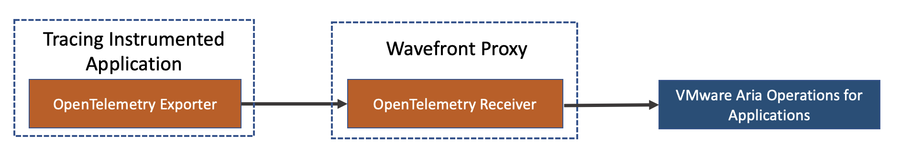
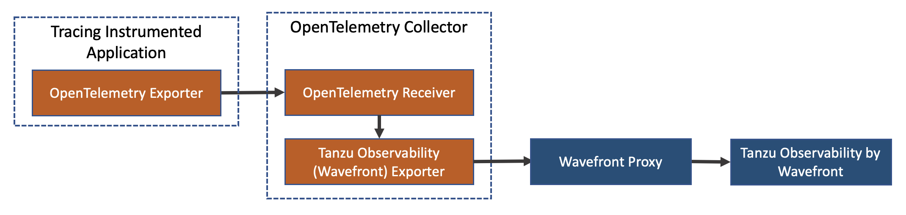
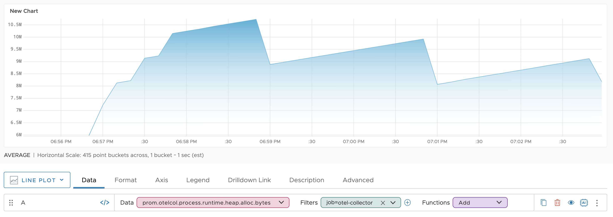

# Sending Data to Tanzu Observability by Wavefront

If you use OpenTelemetry, you can configure the application to send traces or metrics to Tanzu Observability using the Wavefront Proxy or the OpenTelemetry Collector.

## Directly Send Data Using the Wavefront Proxy - (Recommended)

Send trace data or metrics data to Tanzu Observability using only the Wavefront proxy:



Follow these steps:

1. [Install the Wavefront Proxy](https://docs.wavefront.com/proxies_installing.html) version 11.3 or higher.
1. Configure the Wavefront Proxy to send OpenTelemetry data to Tanzu Observability. See the [Wavefront proxy settings for OpenTelemetry](https://docs.wavefront.com/proxies_configuring.html#opentelemetry-proxy-properties).
    * **Trace data**:
      <br/> port 4317 (recommended) with `otlpGrpcListenerPorts` **or** port 4318 (recommended) with `otlpHttpListenerPorts`
    * **Metrics data**: 
      * Port 4317 (recommended) with `otlpGrpcListenerPorts` **or** port 4318 (recommended) with `otlpHttpListenerPorts`
      * To receive the OpenTelemetry resource attributes that your application sends for metrics data, set `otlpResourceAttrsOnMetricsIncluded` to `true`.
        > **Note**: Be aware that setting this to `true` increases the chance of metrics exceeding the [annotations count limit on your Wavefront cluster](https://docs.wavefront.com/wavefront_limits.html#default-customer-specific-limits), causing the metrics to be dropped by the Wavefront Proxy.
      
      For example, the command to start the proxy on Docker:
      ```
      docker run -d \
      -e WAVEFRONT_URL=https://<INSTANCE>.wavefront.com/api/ \
      -e WAVEFRONT_TOKEN=<TOKEN> \
      -e JAVA_HEAP_USAGE=512M \
      -e WAVEFRONT_PROXY_ARGS="--otlpGrpcListenerPorts 4317" \
      -p 2878:2878 \
      -p 4317:4317 \
      wavefronthq/proxy:latest
      ```
      <br/>For example, on Linux, Mac, and Windows:
        * Open the [`wavefront.conf`](https://docs.wavefront.com/proxies_configuring.html#proxy-file-paths) file
        * Add `otlpGrpcListenerPorts=4317`
        * Save the file.


1. Configure your application to send trace data to the Wavefront Proxy. 
    <br/>By default, OpenTelemetry SDKs send data over gRPC to `http://localhost:4317`.
1. Explore trace and metrics data:
    * **Trace data**: 
      <br/>You can use our [tracing dashboards](https://docs.wavefront.com/tracing_basics.html#visualize-distributed-tracing-data) to visualize the requests as traces, which consists of a hierarchy of spans. This visualization helps you pinpoint where the request is spending most of its time and discover problems.
    * **Metrics data**:
        <br/>Explore the metrics data you sent with charts and dashboards.
        * Try out the [Dashboards and Charts tutorial](https://docs.wavefront.com/tutorial_dashboards.html), or watch the video on that page to get started.
        * Create [dashboards](https://docs.wavefront.com/ui_dashboards.html) and [charts](https://docs.wavefront.com/ui_charts.html) for the data you sent to Tanzu Observability. 
          <br/>You need to have the required permissions to do these tasks.


## Send Data Using the OpenTelemetry Collector and the Wavefront Proxy
If you have already configured your application to send data to the OpenTelemetry Collector, the data flows from your application to Tanzu Observability as shown in the diagram:
 


Follow these steps:

1. [Install the Wavefront Proxy](https://docs.wavefront.com/proxies_installing.html) version 11.3 or higher.
      <ul>
      <li>
        Open port 30001, with <code>customTracingListenerPorts=30001</code>, for the proxy to generate span-level RED metrics.
        </li>
        <li>
          Ensure that port 2878 is open to send spans and metrics to the Wavefront service. For example, on Linux, Mac, and Windows, open the <a href="https://docs.wavefront.com/proxies_configuring.html#proxy-file-paths"><code>wavefront.conf</code></a> file and confirm that <code>pushListenerPorts</code> is set to 2878, and that this configuration is uncommented. 
        </li>
      </ul>
         
1. Configure your application to send trace data to the OpenTelemetry Collector. See the [OpenTelemetry documentation](https://opentelemetry.io/docs/collector/) for details.
1. Export the data from the OpenTelemetry Collector to the Tanzu Observability (Wavefront) trace exporter:
    1. Download the `otelcol-contrib` binary from the latest release of the [OpenTelemetry Collector project](https://github.com/open-telemetry/opentelemetry-collector-releases/releases).
    **Note**: You need to use OpenTelemetry Collector Contrib version v0.51.0 or later to export traces and metrics to Tanzu Observability.
    1. In the same directory, create a file named `otel_collector_config.yaml`.
    1. Copy the configurations in the [preconfigured YAML file](https://github.com/wavefrontHQ/opentelemetry-examples/blob/master/otel_collector_config.yaml) to the file you just created. For details on OpenTelemetry configurations, see [OpenTelemetry Collector Configuration](https://opentelemetry.io/docs/collector/configuration/).
    1. On your console, navigate to the directory you downloaded in the step above and run the following command to start OpenTelemetry Collector:
        ```
        ./otelcol-contrib --config otel_collector_config.yaml
        ``` 
1. Explore trace and metrics data:
    * **Trace data**: 
      <br/>You can use our [tracing dashboards](https://docs.wavefront.com/tracing_basics.html#visualize-distributed-tracing-data) to visualize the requests as traces, which consists of a hierarchy of spans. This visualization helps you pinpoint where the request is spending most of its time and discover problems.
    * **Metrics data**:
        <br/> Try out the [Dashboards and Charts tutorial](https://docs.wavefront.com/tutorial_dashboards.html), or watch the video on that page to get started.
      * Create [dashboards](https://docs.wavefront.com/ui_dashboards.html) and [charts](https://docs.wavefront.com/ui_charts.html) for the data you sent to Tanzu Observability. 
      <br/>You need to have the required permissions to do these tasks.
    
      Example:
      


### Metrics Conversion 

The OpenTelemetry metrics your applications send are converted to the [Wavefront data format](https://docs.wavefront.com/wavefront_data_format.html) as follows:


For more information on the Tanzu Observability metrics, see [Metric Types](https://docs.wavefront.com/metric_types.html).


## Tutorials

The Wavefront OpenTelemetry GitHub repository includes specific examples for using the OpenTelemetry collector in Java, Python, .NET, and more. 
 
* If you are on Wavefront Documentation, expand the tutorials section under OpenTelemetry, and try out a tutorial.
* If you are on the GitHub repository, for example, go to the `java-examples` folder and follow the steps in the README to instrument Java Apps with OpenTelemetry. 

<!-- 
## License
[Apache 2.0 License - NEEDS TO BE LINKED ONCE ADDED]()
-->

## Getting Support
* If you run into any issues with the examples, let us know by creating a GitHub issue on the [Wavefront OpenTelemetry GitHub repository](https://github.com/wavefrontHQ/opentelemetry-examples).
* If you didn't find the information you are looking for in our [Wavefront Documentation](https://docs.wavefront.com/), create a GitHub issue or PR in our [docs repository](https://github.com/wavefrontHQ/docs).
