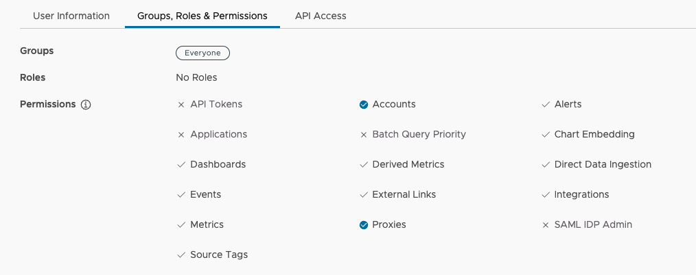
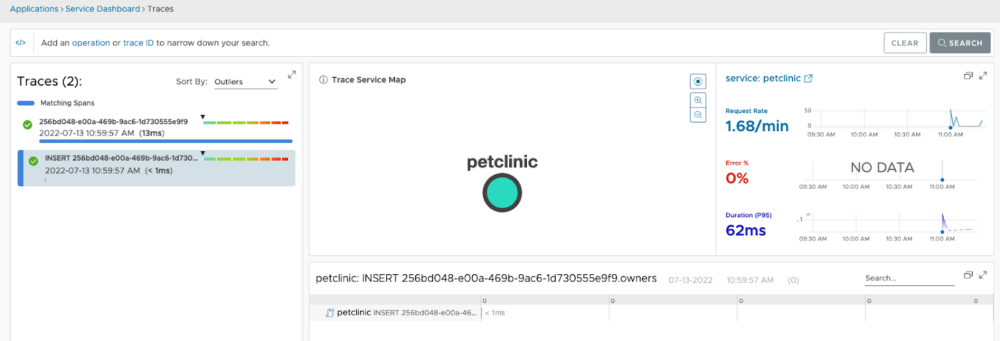
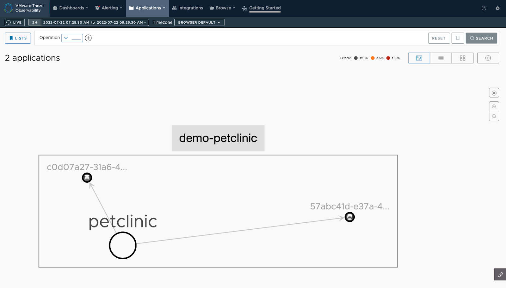
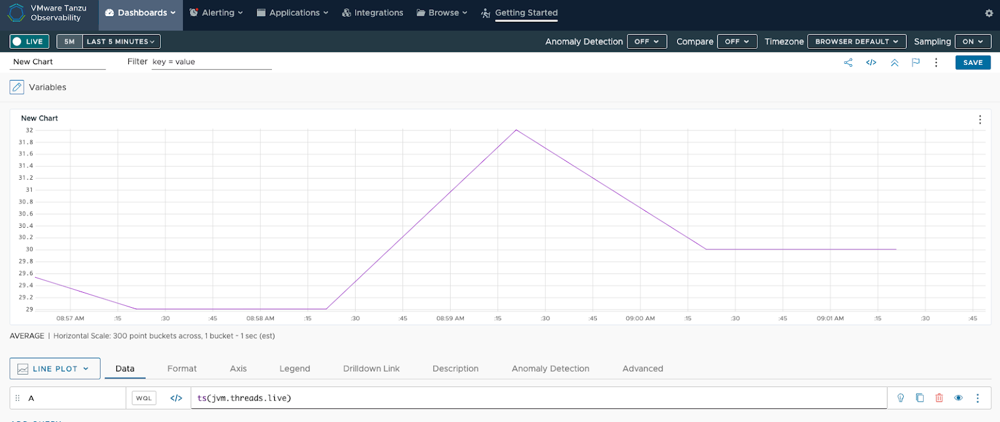
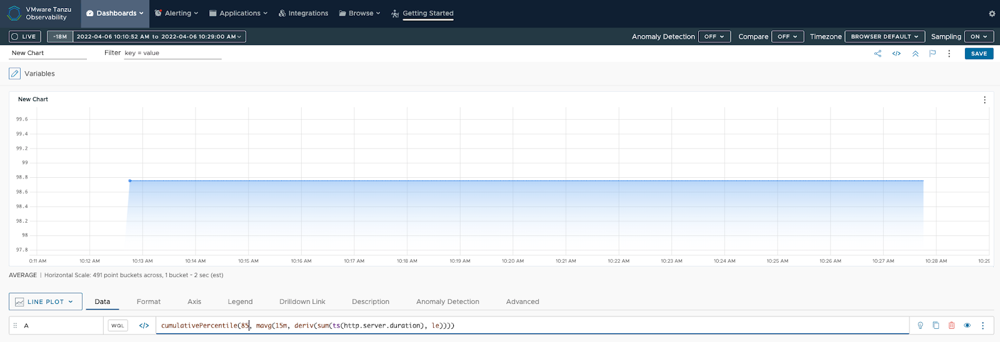

# Auto Instrumenting Java Apps with OpenTelemetry

This guide shows you how to auto instrument your Java application using the OpenTelemetry Java agent. and send data to our service. 


## Prerequisites

* A VMware Aria Operations for Applications (formerly known as Tanzu Observability by Wavefront) account to visualize and monitor your application health. If you don’t have one already, you can sign up on [our website](https://www.vmware.com/products/aria-operations-for-applications.html). 
* Docker to run the Wavefront proxy. 
* Java 11 or higher
* Maven


## Install the Wavefront Proxy

Follow these steps to install the Wavefront proxy using Docker. See [Install a Proxy](https://docs.wavefront.com/proxies_installing.html#install-a-proxy) to find other options for installing the proxy on your environment.

1. Make sure you have **Proxies** permission by going to `https://{cluster}.wavefront.com/userprofile/groups`. A checkbox next to **Proxies** indicates you have permission. If you don’t see a checkbox next to **Proxies**, your administrator needs to add this permission to your user account.
    

1. [Generate an API Token](https://docs.wavefront.com/wavefront_api.html#generating-an-api-token).
1. Run the following command to install the proxy:
    ```
    docker run -d \
        -e WAVEFRONT_URL=https://{CLUSTER}.wavefront.com/api/ \
        -e WAVEFRONT_TOKEN={TOKEN} \
        -e JAVA_HEAP_USAGE=512m \
        -e WAVEFRONT_PROXY_ARGS="--otlpGrpcListenerPorts 4317" \
        -p 2878:2878 \
        -p 4317:4317 \
        wavefronthq/proxy:latest
    ```
    You need to:
    * Replace `{CLUSTER}` with the name of your cluster.
    * Replace `{TOKEN}` with the API token that you generated. 
1. Confirm that the proxy is running.
    ```
    docker ps
    ```

    If `docker ps` does not list the Wavefront proxy, it means that the Wavefront proxy stopped running. If this happens, use `docker logs <container ID>` to view the logs and find the issue. The docker command you ran in step 3 prints out the container ID.

## Run the Auto-Instrumented Application

For instrumentation, you use the Java agent provided by OpenTelemetry, which can be attached to any Java application. This agent dynamically injects bytecode to collect telemetry data, and developers can avoid manual instrumentation. 

1. Clone the Spring Petclinic application and navigate to the directory.
    ```
    git clone https://github.com/spring-projects/spring-petclinic.git
    cd spring-petclinic
    ```

1. Run `./mvnw package` from the root directory of the project.
1. Download the OpenTelemetry Java agent.
1. Assign the file path to the `JAVA_AGENT` variable.
    ```
    JAVA_AGENT= <path to OpenTelemetry Java agent>
    ```
1. Attach the Java agent and start the Spring Petclinic application.
    ```
    java -javaagent:$JAVA_AGENT -Dotel.service.name=petclinic -Dotel.resource.attributes=application=demo-petclinic -Dotel.exporter.otlp.metrics.temporality.preference=DELTA -Dotel.exporter.otlp.metrics.default.histogram.aggregation=EXPONENTIAL_BUCKET_HISTOGRAM -jar target/*.jar
    ```

1. Navigate to http://localhost:8080 and interact with the Petclinic application to generate telemetry data.

## View the Metrics and Distributed Traces

You can see the traces on the Traces Browser and the Application Map, and metrics on charts.

### View Traces

* **Traces Browser**: On the toolbar, click **Applications** > **Traces**. You see the traces sent by the Petclinic application.
    Example:
    
* **Application Map**: On the toolbar, click **Applications** > **Application Status**. You see the Petclinic application and the services it communicates with when sending data to our service.
    Example:
    

### Create Charts with Metrics

When the metrics data collected from the Wavefront Proxy are sent to our service, you can examine them in our user interface.

Example:

* The query `ts(jvm.threads.live)` shows the total number of live threads in the Petclinic application.
    Example:
    

* This query `cumulativePercentile(85, mavg(15m, deriv(sum(ts(http.server.duration), le))))` shows the 85th percentile of HTTP response times over the last 15 minutes. In this case, 85 percent of the HTTP response times are 98.75ms or less.
    **Note**: This query can take up to 15 minutes to complete.
    Example:
    