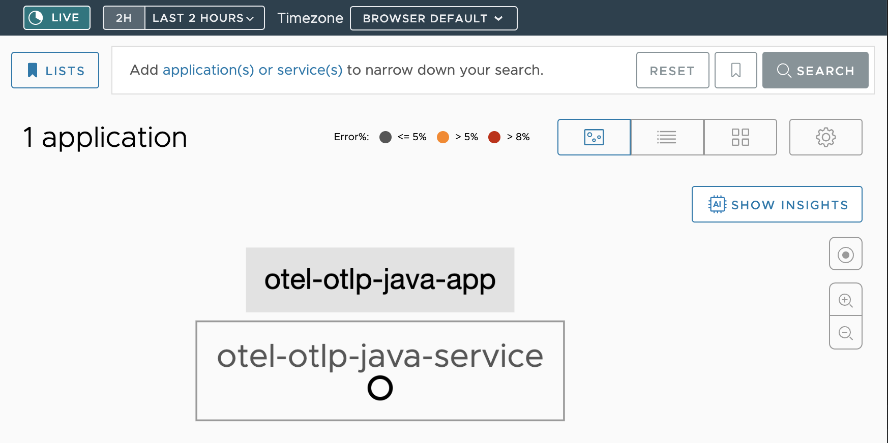
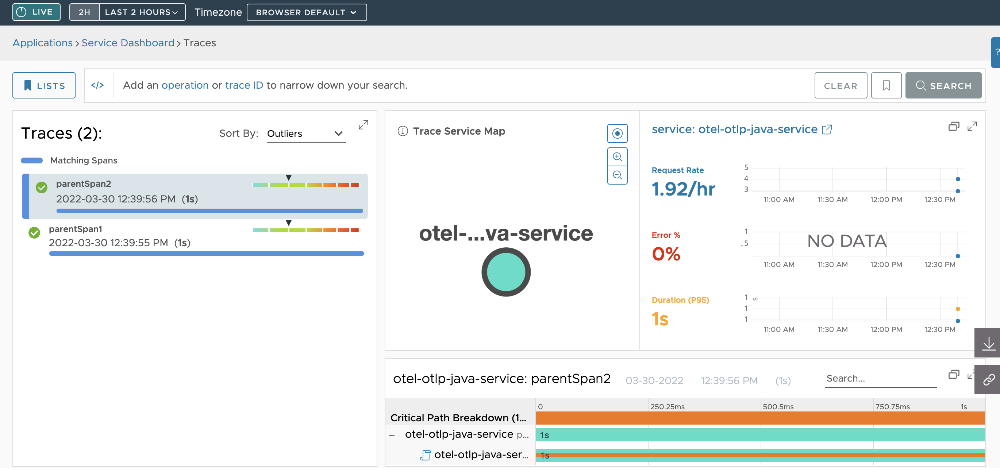

# Instrumenting Java Apps with OpenTelemetry

This guide shows you how to manually instrument your Java application using the OpenTelemetry API and the OpenTelemetry SDK. The data is sent to Tanzu Observability using the OpenTelemetry Collector and the Wavefront Proxy. To learn about on the data flow from your application to Tanzu Observability by Wavefront, see [Send Trace Data Using the OpenTelemetry Collector](https://docs.wavefront.com/opentelemetry_tracing.html#send-data-using-the-opentelemetry-collector).

*Tip : See the blog [Getting started with OpenTelemetry](https://tanzu.vmware.com/content/blog/getting-started-opentelemetry-vmware-tanzu-observability#devops), for steps on auto instrumenting your Java application.*

## Table of Content

* [Prerequisite](#prerequisite)
* [Send Data to Tanzu Observability](#send-data-to-tanzu-observability)
* [OpenTelemetry Building Blocks of the Application](#opentelemetry-building-blocks-of-the-application)
* [Next Steps](#next-steps)

## Prerequisite

* [Install the Wavefront proxy](https://docs.wavefront.com/proxies_installing.html).
* [Set up an OpenTelemetry Collector for Tanzu Observability](../opentelemetry-examples#opentelemetry-collector). 

## Send Data to Tanzu Observability

1. Open the `pom.xml` file in the `java-example` directory using your IDE, and right-click and select **Add as a Maven Project**.

  The [```pom.xml```](https://github.com/wavefrontHQ/opentelemetry-examples/blob/master/java-example/pom.xml)
file is already configured with the required dependencies.

2. Run the application either from the IDE or using the terminal: 
  ```
    mvn compile exec:java -Dexec.mainClass="com.vmware.App" 
  ```

  The ```main``` method in this Java application triggers the application to generate and emit a transaction trace, which includes a parent span and a few child spans.

You can examine the data sent by the application to Tanzu Observability on the [Tanzu Observability user interface](https://docs.wavefront.com/tracing_ui_overview.html).

Example: Application Status


Example: Traces Browser


## OpenTelemetry Building Blocks of the Application

* #### OpenTelemetry Interface
  You need to configure an instance of the `OpenTelemetrySdk` as early as possible in your application. This can be done using the `OpenTelemetrySdk.builder()` method.

  ```java
      static OpenTelemetry initOpenTelemetry() {
        OtlpGrpcSpanExporter spanExporter = getOtlpGrpcSpanExporter();
        BatchSpanProcessor spanProcessor = getBatchSpanProcessor(spanExporter);
        Resource serviceNameResource = Resource
                .create(Attributes.of(ResourceAttributes.SERVICE_NAME, SERVICE_NAME));
        SdkTracerProvider tracerProvider = getSdkTracerProvider(spanProcessor, serviceNameResource);
        OpenTelemetrySdk openTelemetrySdk = getOpenTelemetrySdk(tracerProvider);
        Runtime.getRuntime().addShutdownHook(new Thread(tracerProvider::shutdown));

        return openTelemetrySdk;
      }

      private static OpenTelemetrySdk getOpenTelemetrySdk(SdkTracerProvider tracerProvider) {
        OpenTelemetrySdk openTelemetrySdk = OpenTelemetrySdk.builder().setTracerProvider(tracerProvider)
          .buildAndRegisterGlobal();
        return openTelemetrySdk;
      }

      private static SdkTracerProvider getSdkTracerProvider(BatchSpanProcessor spanProcessor, Resource serviceNameResource) {
        SdkTracerProvider tracerProvider = SdkTracerProvider.builder().addSpanProcessor(spanProcessor)
          .setResource(Resource.getDefault().merge(serviceNameResource)).build();
        return tracerProvider;
      }

      private static BatchSpanProcessor getBatchSpanProcessor(OtlpGrpcSpanExporter spanExporter) {
        BatchSpanProcessor spanProcessor = BatchSpanProcessor.builder(spanExporter)
          .setScheduleDelay(100, TimeUnit.MILLISECONDS).build();
        return spanProcessor;
      }

      private static OtlpGrpcSpanExporter getOtlpGrpcSpanExporter() {
        OtlpGrpcSpanExporter spanExporter = OtlpGrpcSpanExporter.builder()
          .setEndpoint(OTEL_COLLECTOR_ENDPOINT)
          .setTimeout(2, TimeUnit.SECONDS)
          .build();
       return spanExporter;
      }
  ```
  If you are writing library instrumentation, it is recommended that you provide the users with the
  ability to inject an instance of `OpenTelemetry` into the instrumentation code. If this is not possible for some reason, you can fall back on using an instance from the `GlobalOpenTelemetry` class. 
  
  **Note**: You can’t force end-users to configure the global OpenTelemetry class.

* #### Get a Tracer
  The `Tracer` is responsible for creating spans and interacting with the `Context`. A `Tracer` needs to be acquired using the OpenTelemetry API. You need to specify the name and version of the library that is instrumenting your library or application.
  ```java
    private static Tracer getTracer() {
        tracer = openTelemetry.getTracer(<my_instrumentation_library_name>, <my_instrumentation_library_version>);         
        return tracer;
    }
  ```
  **Note**: the ```my_instrumentation_library_name``` and ```my_instrumentation_library_version``` of the `Tracer` are purely informational. All `Tracers` created by a single OpenTelemetry instance will work together, regardless of the name or version.

* #### Create a Nested Span, Add an Attribute
  To create a basic span, you only need to specify the name of the span. The start and end time of the span is automatically set by the OpenTelemetry SDK. Most of the time, you need to correlate spans for nested operations. 
  
  In OpenTelemetry spans can be created freely, and it’s up to the implementor to annotate them with attributes specific to the operation. `Attributes` provide additional context on a span and about the specific operation it tracks, such as results or properties of an operations. 
  
  The spans can be manually linked for the `main` method to call the `child` method in the following way:
  
    ```java
      public static void main(String[] args) throws InterruptedException {

        /*this will make sure that a proper service.name attribute is set on all the
         spans/metrics.*/
        System.setProperty(OTEL_RESOURCE_ATTRIBUTES_KEY, OTEL_RESOURCE_ATTRIBUTES_VALUE);

        /*tracer must be acquired, which is responsible for creating spans and interacting with the Context*/
        tracer = getTracer();

        /*an automated way to propagate the parent span on the current thread*/
        for (int index = 0; index < 3; index++) {
            /*create a span by specifying the name of the span. The start and end time of the span is automatically set by the OpenTelemetry SDK*/
            Span parentSpan = tracer.spanBuilder("parentSpan").setNoParent().startSpan();
            logger.info("In parent method. TraceID : {}", parentSpan.getSpanContext().getTraceIdAsHexString());

            /*put the span into the current Context*/
            try (Scope scope = parentSpan.makeCurrent()) {

                /*annotate the span with attributes specific to the represented operation, to provide additional context*/
                parentSpan.setAttribute("parentIndex", index);
                childMethod(parentSpan);
            } catch (Throwable throwable) {
                parentSpan.setStatus(StatusCode.ERROR, "Something wrong with the parent span");
            } finally {
                /*closing the scope does not end the span, this has to be done manually*/
                parentSpan.end();
            }
        }

        /*sleep for a bit to let everything settle*/
        Thread.sleep(2000);
    }

    private static void childMethod(Span parentSpan) {

        tracer = getTracer();

        /*setParent(...) is not required, `Span.current()` is automatically added as the parent*/
        Span childSpan = tracer.spanBuilder("childSpan").setParent(Context.current().with(parentSpan))
                .startSpan();
        logger.info("In child method. TraceID : {}", childSpan.getSpanContext().getTraceIdAsHexString());

        /*put the span into the current Context*/
        try (Scope scope = childSpan.makeCurrent()) {
            Thread.sleep(1000);
        } catch (Throwable throwable) {
            childSpan.setStatus(StatusCode.ERROR, "Something wrong with the child span");
        } finally {
            childSpan.end();
        }
    }
    ```
## Next Steps
The above-mentioned example is a very basic example. Refer [the OpenTelemetry guide](https://opentelemetry.io/docs/instrumentation/java/manual_instrumentation/) for more details, such as `events`, `links`, `context propagation`, and more.
