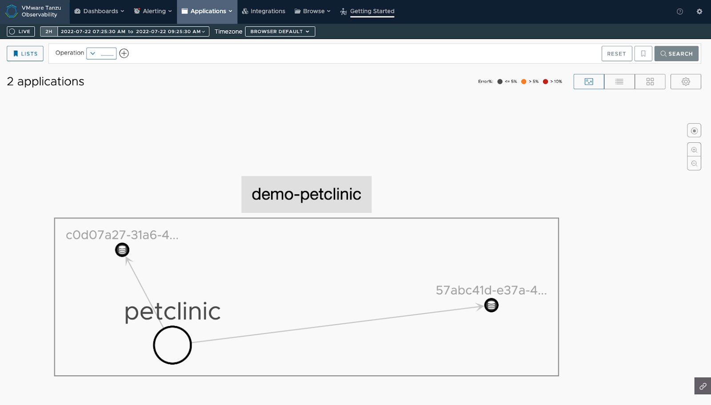

# Auto Instrumenting Java Apps with OpenTelemetry

This guide shows you how to auto instrument your Java application using the OpenTelemetry Java agent and send data to our service. 

## Prerequisites

* A VMware Aria Operations for Applications (formerly known as Tanzu Observability by Wavefront) account to visualize and monitor your application health. If you don’t have one already, you can sign up on [our website](https://www.vmware.com/products/aria-operations-for-applications.html). 
* Docker to run the Wavefront proxy. 
* Java 11 or later.
* Maven

## Install the Wavefront Proxy

[Install the Wavefront proxy](http://docs.wavefront.com/proxies_installing.html#install-a-proxy). You need to add the following configurations to the default proxy installation configurations.
```
-e WAVEFRONT_PROXY_ARGS="--otlpGrpcListenerPorts 4317" \
-p 4317:4317 \  
```
## Run the Auto-Instrumented Application

For instrumentation, you use the Java agent provided by OpenTelemetry, which can be attached to any Java application. This agent dynamically injects bytecode to collect telemetry data, and developers can avoid manual instrumentation. 

1. Clone the Spring Petclinic application and navigate to the directory.
    ```
    git clone https://github.com/spring-projects/spring-petclinic.git
    cd spring-petclinic
    ```

1. Run `./mvnw package` from the root directory of the project.
1. Download the OpenTelemetry Java agent.
    ```
    curl -L https://github.com/open-telemetry/opentelemetry-java-instrumentation/releases/latest/download/opentelemetry-javaagent.jar --output otelagent.jar
    ```
1. Assign the file path to the `JAVA_AGENT` variable.
    ```
    JAVA_AGENT=./otelagent.jar
    ```
1. Attach the Java agent and start the Spring Petclinic application.
    ```
    java -javaagent:$JAVA_AGENT -Dotel.service.name=petclinic -Dotel.resource.attributes=application=demo-petclinic -Dotel.exporter.otlp.metrics.temporality.preference=DELTA -Dotel.exporter.otlp.metrics.default.histogram.aggregation=EXPONENTIAL_BUCKET_HISTOGRAM -jar target/*.jar
    ```

1. Navigate to [http://localhost:8080](http://localhost:8080) and interact with the Petclinic application to generate telemetry data.

## View the Metrics and Distributed Traces

You can see the traces on the Traces Browser and the Application Map, and metrics on charts.

### View Traces

* **Traces Browser**: On the toolbar, click **Applications** > **Traces**. You see the traces sent by the Petclinic application.
    Example:
    
* **Application Map**: On the toolbar, click **Applications** > **Application Status**. You see the Petclinic application and the services it communicates with when sending data to our service.
    Example:
    

### Create Charts with Metrics

When the metrics data collected from the Wavefront proxy are sent to our service, you can examine them in our user interface.

Example:

The query `ts(jvm.threads.live)` shows the total number of live threads in the Petclinic application.


## Learn More!

To manually configure your application and send data to our service, see [Instrumenting Java Apps with OpenTelemetry](https://github.com/wavefrontHQ/opentelemetry-examples/tree/master/java-example/otel-collector#instrumenting-java-apps-with-opentelemetry).